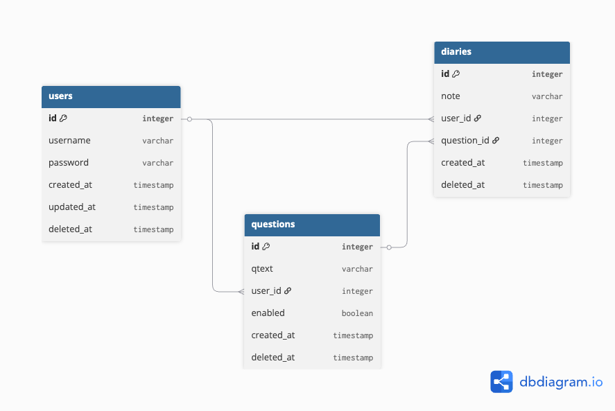
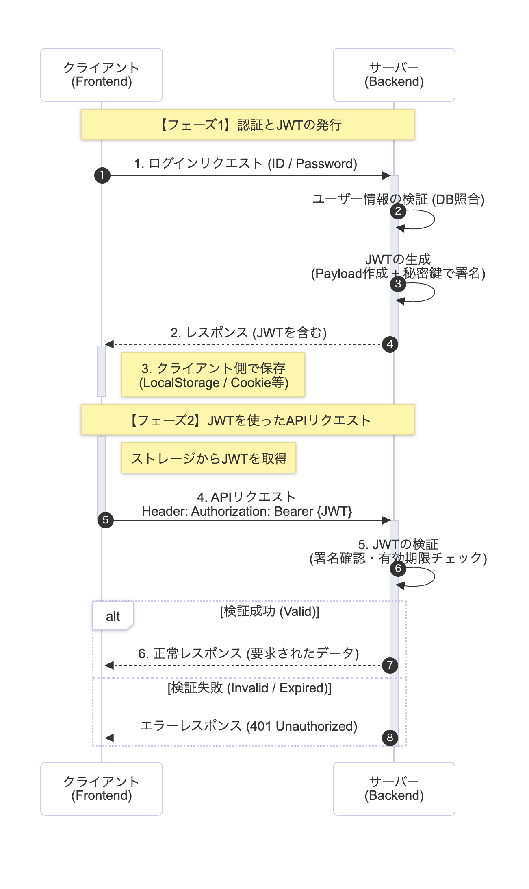

# Diary-Note App

ひとこと日記アプリです。  
提示された質問に対して、日々回答を記録してみましょう！

デプロイメント先：https://diary-note-app-418599517444.asia-northeast1.run.app


# Tech Stack

- Backend
  - Go
  - ORM: GORM
  - DB: Postgres
  - Server: Gin
- Frontend
  - Typescript
  - Framework: Vite React
  - Design Frame: Antdesign

# How to Setup

1. このリポジトリーをクローンする
2. PC 上でこのプロジェクトを開く
3. Go サーバーの起動に必要なライブラリをインストール（# Backend: dependencies を参照）
4. 開発用サーバーの起動

```
$ go run main.go
```

5. フロントエンドの依存関係をインストール

```
$ cd frontend
$ yarn
```

6. 開発用フロントエンドの起動

```
yarn dev
```

## Backend: dependencies

```bash
go get -u github.com/gin-gonic/gin
go get -u gorm.io/gorm
go get -u gorm.io/driver/postgres
go get -u github.com/joho/godotenv
go get -u golang.org/x/crypto/bcrypt
go get -u github.com/golang-jwt/jwt/v5
```

# How to Build and Production Run

ビルド方法とプロダクション実行（ビルド後に実行）の方法を記載します。

なお、このプロジェクトでは Docker ファイルを用いたビルドも利用可能です。  
Docker イメージを作る際は、Docker が利用可能な環境で、下記のコマンドを実行してください。

```
docker build -t [Image-Label] .
```

Docker ビルドではなく、手動でのビルド手順を下記に示します。

1. Go 依存関係ファイルをダウンロード

```
$ go mod download
```

2. Go をビルド

```
$ go build -o main main.go
```

3. frontend に移動して、Vite でビルド

```
$ cd frontend
frontend $ yarn
frontend $ yarn build
```

4. サーバービルド済みバイナリを実行

```
frontend $ cd ../
$ ./main
```

## 設定が必要な環境変数

```
# DATABASE CONNECTION STRINGS
DB_HOST=
DB_USER=
DB_PASSWORD=
DB_NAME=
DB_PORT=

# or DATABASE CONNECTION URL(こちらが定義されている場合は優先されます)
DB_URL=

# JWT用署名鍵
AUTH_SECRET=

# サーバー起動(Listen)ポート
PORT=3000
```

# Database Schema

モデル定義ファイルは、`/src/models`　に記載しています。

リレーションは下図のとおりです。



# Authorization Flow

本サーバーではユーザー認証を実装しています。

パスワードは Bcrypt によるハッシュ化を行っています。

API の認証は Authorization ヘッダに格納された JWT を介して行います。  
なお、JWT はユーザー登録またはログイン時に発行します。



# Articles

- [Go 初心者が Go+gin で API サーバーを作る](https://qiita.com/lunasky-hy/private/6415fe7fa6a2ab53a51f)
- [Go + gin + bcrypt + jwt で認証！](https://qiita.com/lunasky-hy/private/b527a256855a125e4fd3)
- [React で認証 Token を保存する MyBestPractice](https://qiita.com/lunasky-hy/private/3b0ab09197dbacf5d340)

# License

Not Defiend.
